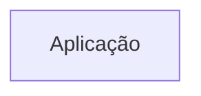
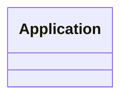
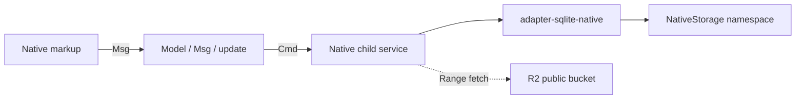
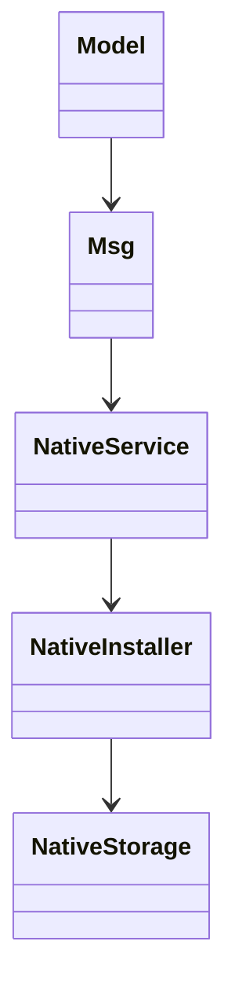

# Arquitetura

<!-- specsfy:documentator:start -->
## Componentes

| Tipo | Quantidade |
| --- | --- |
| Código | 336 |
| Testes | 91 |

## Diagramas

<!-- specsfy:documentator:end -->

## Consumer Native

- `apps/consumer-native/src/core.ts` mantém `Model`, `Msg` e `update` síncronos e
  determinísticos. I/O é disparado por `Cmd`/`Msg`; o core não importa Node,
  DOM, services ou SQLite.
- `apps/consumer-native/src/app.native` compõe uma janela GPU única com as áreas
  Biblioteca, Leitor e Busca. O service `child` conecta os comandos ao adapter.
- `@openbible/adapter-sqlite-native` depende somente de exports públicos da
  engine e usa parser legado read-only sobre bytes da `NativeStorage`. A
  aquisição Native também é uma capacidade do adapter: ranges recebidos pelo
  service são staged sequencialmente antes de chamar o commit local.

Host status is recorded in `apps/consumer-native/native-sdk-matrix.json`:
Linux passed the Native check/test/build path with GPU/software, while macOS and
Windows remain `unverified`; strict doctor is blocked by missing WebKitGTK 6.0.
