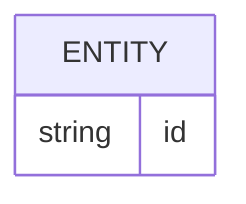
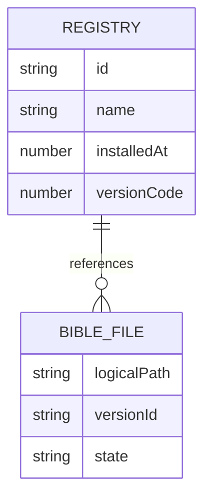

# Banco de dados

<!-- specsfy:documentator:start -->
## Fontes de persistência

| Arquivo |
| --- |
| Nenhuma estrutura confirmada além das fontes listadas. |

<!-- specsfy:documentator:end -->

## Native SDK

The Native adapter uses logical app-local storage rather than exposing physical
paths to the engine or UI.

| Logical store | Contents | Lifecycle |
| --- | --- | --- |
| `registry.json` | JSON array of installed version metadata | Atomic replacement through `registry.json.tmp` |
| `bibles/<id>.db` | Legacy SQLite bytes | Final file after validation and promotion |
| `bibles/<id>.db.tmp/.bak/.trash` | Installation and removal intermediates | Removed or restored by rollback/reconciliation |
| `downloads/<id>.sqlite.part` | Sequential remote package staging | Removed after commit, reset or failed installation |

The physical namespace is owned by the Native service. The adapter owns
validation, promotion, registry updates, download staging, rollback and
best-effort startup reconciliation. The consumer does not import a fixture at
runtime; the test harness uses an in-memory `NativeStorage` and synthetic SQLite
bytes.
