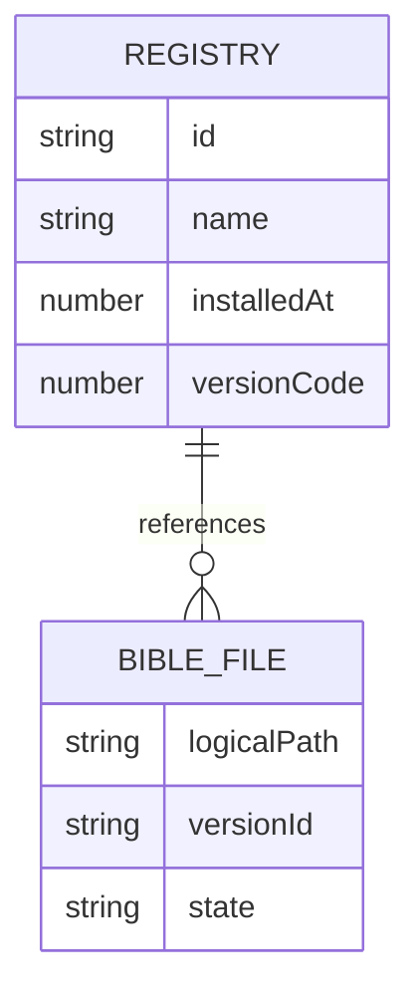
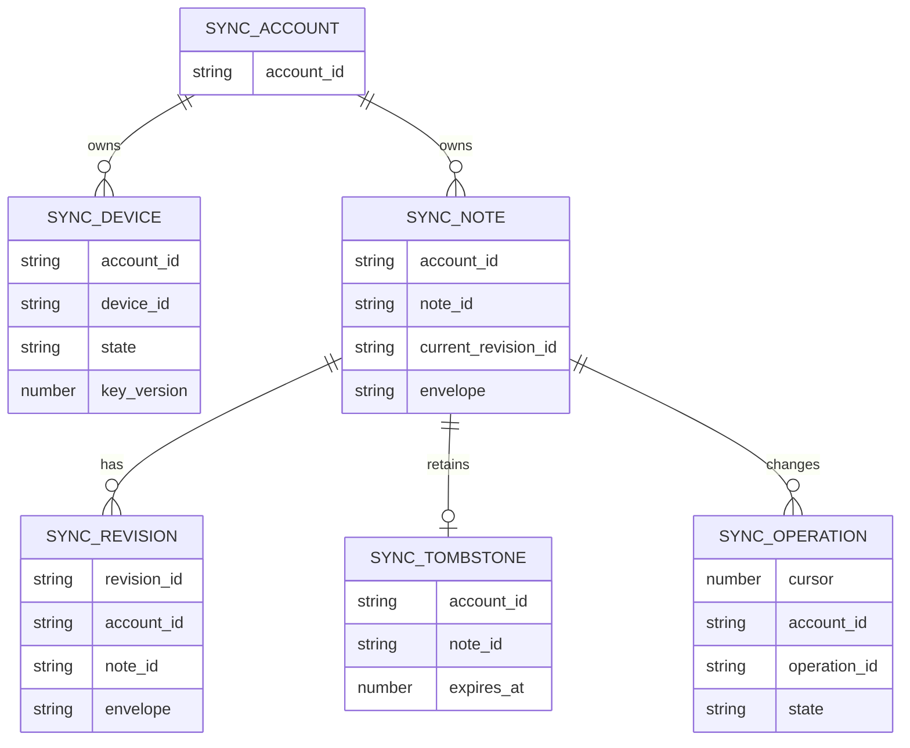

# Banco de dados

<!-- specsfy:documentator:start -->
## Fontes de persistência

| Arquivo |
| --- |
| apps/consumer-web/migrations/001-better-auth.sql |
| Nenhuma estrutura confirmada além das fontes listadas. |

<!-- specsfy:documentator:end -->

## Native SDK

The Native adapter uses logical app-local storage rather than exposing physical
paths to the engine or UI.

| Logical store | Contents | Lifecycle |
| --- | --- | --- |
| `registry.json` | JSON array of installed version metadata | Atomic replacement through `registry.json.tmp` |
| `bibles/<id>.db` | Legacy SQLite bytes | Final file after validation and promotion |
| `bibles/<id>.db.tmp/.bak/.trash` | Installation and removal intermediates | Removed or restored by rollback/reconciliation |
| `downloads/<id>.sqlite.part` | Sequential remote package staging | Removed after commit, reset or failed installation |

The physical namespace is owned by the Native service. The adapter owns
validation, promotion, registry updates, download staging, rollback and
best-effort startup reconciliation. The consumer does not import a fixture at
runtime; the test harness uses an in-memory `NativeStorage` and synthetic SQLite
bytes.

## Remote Sync Turso/libSQL

The `@openbible/adapter-sync-turso` package owns a versioned remote schema
separate from Better Auth. It stores encrypted envelopes and technical metadata,
never note plaintext or private keys.

| Table | Purpose | Key constraints |
| --- | --- | --- |
| `sync_schema_migrations` | Applied Sync schema versions | Unique version |
| `sync_devices` | Account devices and key state | `(account_id, device_id)` |
| `sync_notes` | Current encrypted note envelope | `(account_id, note_id)` |
| `sync_revisions` | Encrypted revision history | `revision_id` |
| `sync_tombstones` | Retained remote deletions | `(account_id, note_id)`, 90-day expiry |
| `sync_operations` | Idempotent operation log and cursor | `(account_id, operation_id)`, autoincrement cursor |
| `sync_bible_preferences` | Bible metadata preferences | `(account_id, version_id)` |
| `sync_account_deletion_jobs` | Deferred account deletion | Unique account |

