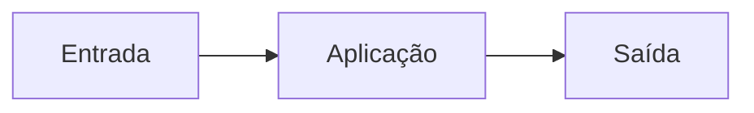
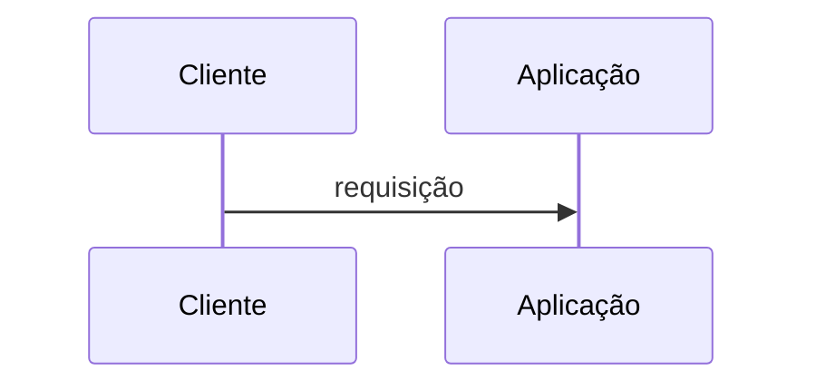
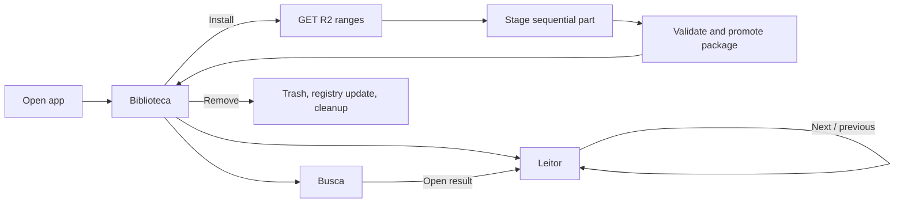
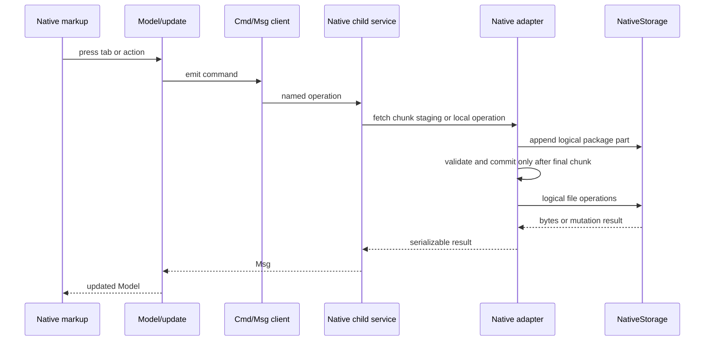

# Fluxos

<!-- specsfy:documentator:start -->
## Fluxo principal

<!-- specsfy:documentator:end -->

## Native Scripture journey

The automated proof covers installation, removal, reopen, chapter navigation,
keyboard search, empty query and zero results. It was run at `1080x720` and the
minimum `720x520` window size.
